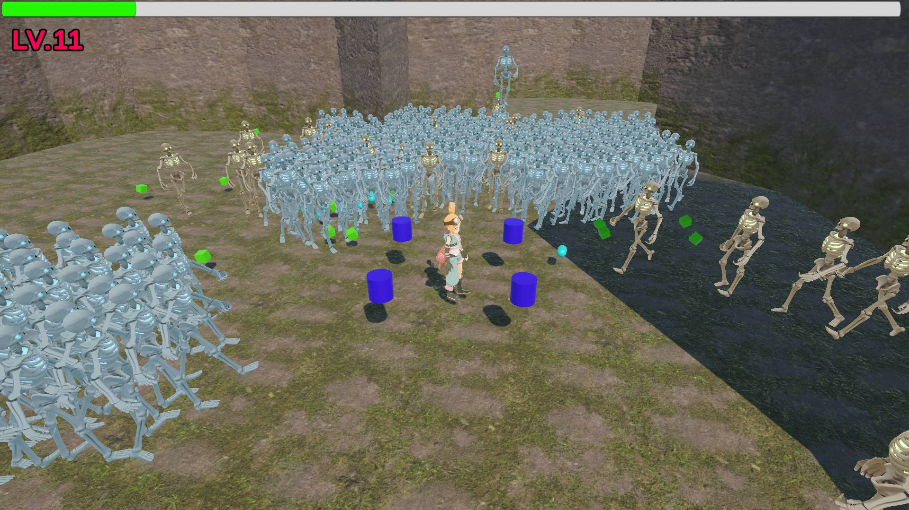
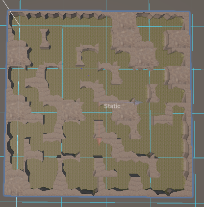
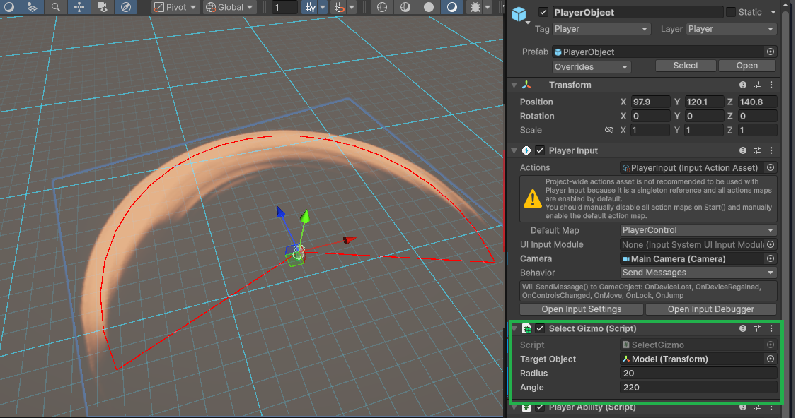
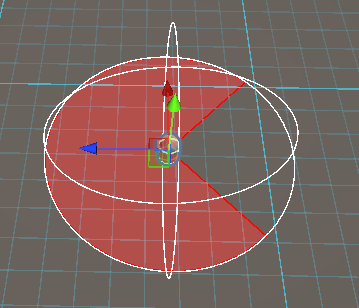

# Unity_3D_GameProject

## 🎮 [유니티C# 3D 로그라이크]
> 로그라이크 장르 게임의 코어루프를 구현해보며 최적화를 진행하거나 3차원 공간에서의 발생하는 문제점을 고민해보았습니다.
* 기간 : 3주(26.01 ~ 26.02)
* 인원 : 1인
* 장르 : 3D 로그라이크

### **🛠 Tech Stack**
<div>
  
    <!-- Unity 6.2 -->
  
  
</div>
<div>
  <!-- VS Code -->
  
  <!-- Visual Studio 2022 -->
  
</div>

## 상세 개발 (Click to view)
( .cs 클릭 시 코드로 이동합니다.)

### 스키닝 메시 GPU 인스턴싱 및 VAT(Virtual Animation Texture) 툴
* [TextureBaker.cs](Assets/Scripts/GPUInstancing/TextureBaker.cs)                   - VAT Tool



### 상태 패턴 및 Raycasting 기반의 지형 극복(Climb & Jump) 몬스터 이동 시스템 구현몬스터 웨이브 시스템
* [MonsterController.cs](Assets/Scripts/Monster/MonsterController.cs)   - 몬스터 움직임 관리 및 상태 헬퍼 함수
* [ClimbState.cs](Assets/Scripts/Monster/ClimbState.cs)                 - Climb 상태
* [HitState.cs](Assets/Scripts/Monster/HitState.cs)                     - Hit 상태
* [JumpState.cs](Assets/Scripts/Monster/JumpState.cs)                   - Jump 상태


### Reflection을 활용한 Generic CSV-to-ScriptableObject 데이터 파서
* [CsvImporter.cs](Assets/Scripts/Editor/CsvImporter.cs)                - 리플렉션을 활용한 제네릭 CSV 임포터
* [AbilityData.csv](Assets/Scripts/GameData/AbilityData.csv)            - 능력 데이터 CSV
* [AbilityDataBaseSO.cs](Assets/Scripts/GameData/AbilityDataBaseSO.cs)  - 스크립터블 오브젝트를 활용한 데이터 관리
<table>
    <tr>
        <td></td>
        <td></td>
    </tr>
</table>

### WFC(Wave Function Collapse) 알고리즘을 활용한 절차적 맵 생성
* [WFCGenerator.cs](Assets/Scripts/MapGenerator/WFCGenerator.cs)                     - WFC 던전 생성 모듈
<table>
    <tr>
        <td></td>
        <td></td>
    </tr>
    <tr>
        <td></td>
        <td></td>
    </tr>
</table>

### Object Pool Management
* [GenericObjectPool.cs](Assets/Scripts/Global/GenericObjectPool.cs)
* [PoolManager.cs](Assets/Scripts/Manager/PoolManager.cs)

### 무기 및 Hit
<table>
    <tr>
        <td></td>
        <td></td>
    </tr>
</table>


##  한 눈에 보기 (Click to view)
이 프로젝트의 주요 코드는 아래 스크립트에서 확인할 수 있습니다.
( .cs 클릭 시 코드로 이동합니다.)

### 캐릭터
* [PlayerInputManager.cs](Assets/Scripts/Player/PlayerInputManager.cs)  - 유저 입력 처리
* [PlayerController.cs](Assets/Scripts/Player/PlayerController.cs)      - 플레이어 캐릭터 이동 로직

### 플레이어 능력
* [PlayerAbility.cs](Assets/Scripts/Player/PlayerAbility.cs)        - 아이템 처리, 경험치 및 레벨 관리, 무기 레벨 관리
* [PlayerWeapon.cs](Assets/Scripts/Player/PlayerWeapon.cs)          - 무기 관리자 소유

### 무기 관리자
* [BulletWeaponManager.cs](Assets/Scripts/Weapon/Manager/BulletWeaponManager.cs)                - 투사체 무기 관리자
* [OrbitWeaponManager.cs](Assets/Scripts/Weapon/Manager/OrbitWeaponManager.cs)                  - 회전 무기 관리자
* [SwordWeaponManager.cs](Assets/Scripts/Weapon/Manager/SwordWeaponManager.cs)                  - 검격(근접 공격) 무기 관리자
* [ThunderStrikeWeaponManager.cs](Assets/Scripts/Weapon/Manager/ThunderStrikeWeaponManager.cs)  - 낙뢰(광역 범위) 무기 관리자

### 무기
* [BulletWeapon.cs](Assets/Scripts/Weapon/BulletWeapon.cs)                               - 투사체 무기
* [OrbitWeapon.cs](Assets/Scripts/Weapon/OrbitWeapon.cs)                                 - 회전 무기
* [SwordWeapon.cs](Assets/Scripts/Weapon/SwordWeapon.cs)                                 - 검격(근접 공격) 무기
* [ThunderStrikeWeapon.cs](Assets/Scripts/Weapon/ThunderStrikeWeapon.cs)                 - 낙뢰(광역 범위) 무기

### 몬스터
* [MonsterController.cs](Assets/Scripts/Monster/MonsterController.cs)   - 몬스터 움직임 관리 및 상태 헬퍼 함수
* [ChaseState.cs](Assets/Scripts/Monster/ChaseState.cs)                 - Chase 상태
* [ClimbState.cs](Assets/Scripts/Monster/ClimbState.cs)                 - Climb 상태
* [HitState.cs](Assets/Scripts/Monster/HitState.cs)                     - Hit 상태
* [JumpState.cs](Assets/Scripts/Monster/JumpState.cs)                   - Jump 상태
* [JumpingState.cs](Assets/Scripts/Monster/JumpingState.cs)             - Jumping 상태

### 데이터
* [CsvImporter.cs](Assets/Scripts/Editor/CsvImporter.cs)                - 리플렉션을 활용한 제네릭 CSV 임포터
* [AbilityData.csv](Assets/Scripts/GameData/AbilityData.csv)            - 능력 데이터 CSV
* [AbilityDataBaseSO.cs](Assets/Scripts/GameData/AbilityDataBaseSO.cs)  - 스크립터블 오브젝트를 활용한 데이터 관리

### 모듈
* [GameAbilityManager.cs](Assets/Scripts/Manager/GameAbilityManager.cs)             - Ability 시스템 모듈
* [WaveManager.cs](Assets/Scripts/Manager/WaveManager.cs)                           - 몬스터 Wave 시스템 모듈
* [WFCGenerator.cs](Assets/Scripts/MapGenerator/WFCGenerator.cs)                     - WFC 던전 생성 모듈
* [MonsterSpawner.cs](Assets/Scripts/Manager/MonsterSpawner.cs)                     - 몬스터 생성 관리 모듈
* [MonsterInstacingManager.cs](Assets/Scripts/Manager/MonsterInstacingManager.cs)   - 몬스터 인스턴싱 렌더링 모듈
* [TextureBaker.cs](Assets\Scripts\GPUInstancing\TextureBaker.cs)                   - VAT Tool


## 🚀 Quick Clone
```bash
git clone https://github.com/CJI2019/Unity_3D_GameProject.git
```